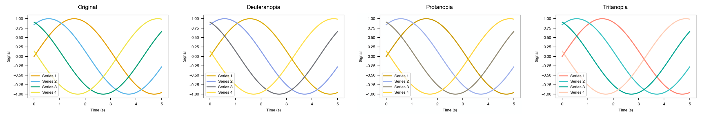

# Accessibility — `plotstyle.color.accessibility`

Simulate how your figure looks under different types of colour vision deficiency.

## `preview_colorblind`

```{eval-rst}
.. autofunction:: plotstyle.color.accessibility.preview_colorblind
```

## `simulate_cvd`

```{eval-rst}
.. autofunction:: plotstyle.color.accessibility.simulate_cvd
```

## `CVDType`

```{eval-rst}
.. autoclass:: plotstyle.color.accessibility.CVDType
   :members:
   :undoc-members:
```

## `CVDSimulationError`

```{eval-rst}
.. autoexception:: plotstyle.color.accessibility.CVDSimulationError
```

## `SIMULATION_MATRICES`

```{eval-rst}
.. autodata:: plotstyle.color.accessibility.SIMULATION_MATRICES
```

## Supported deficiency types

| Type | Affects | Prevalence |
|------|---------|------------|
| `CVDType.DEUTERANOPIA` | Green receptors (M-cone) | ~6% of males |
| `CVDType.PROTANOPIA` | Red receptors (L-cone) | ~2% of males |
| `CVDType.TRITANOPIA` | Blue receptors (S-cone) | < 0.01% of population |

## Usage

### Preview all CVD types

```python
import matplotlib.pyplot as plt
from plotstyle.color.accessibility import preview_colorblind

fig, ax = plt.subplots()
ax.scatter([1, 2, 3], [4, 5, 6], c=["#e41a1c", "#377eb8", "#4daf4a"])

comp = preview_colorblind(fig)
comp.savefig("cvd_preview.png", dpi=150)
```

This creates a four-panel figure: Original, Deuteranopia, Protanopia, Tritanopia.

**Output:**



### Preview specific types only

```python
from plotstyle.color.accessibility import preview_colorblind, CVDType

comp = preview_colorblind(fig, cvd_types=[CVDType.DEUTERANOPIA])
```

### Low-level simulation

Apply a CVD simulation matrix directly to an image array:

```python
import numpy as np
from plotstyle.color.accessibility import simulate_cvd, CVDType

img = np.random.rand(100, 100, 3).astype(np.float32)
result = simulate_cvd(img, CVDType.PROTANOPIA)
# result.shape == (100, 100, 3), values in [0, 1]
```

## Notes

- The simulation applies Machado et al. (2009) matrices directly to
  gamma-encoded sRGB values (as rendered by Matplotlib's Agg backend).
  Results are a visual approximation; they are not equivalent to a
  strictly linearised simulation.
- The source figure is never modified. `preview_colorblind()` returns a new
  figure.
