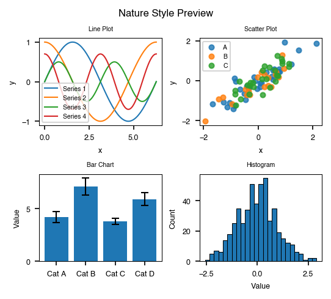
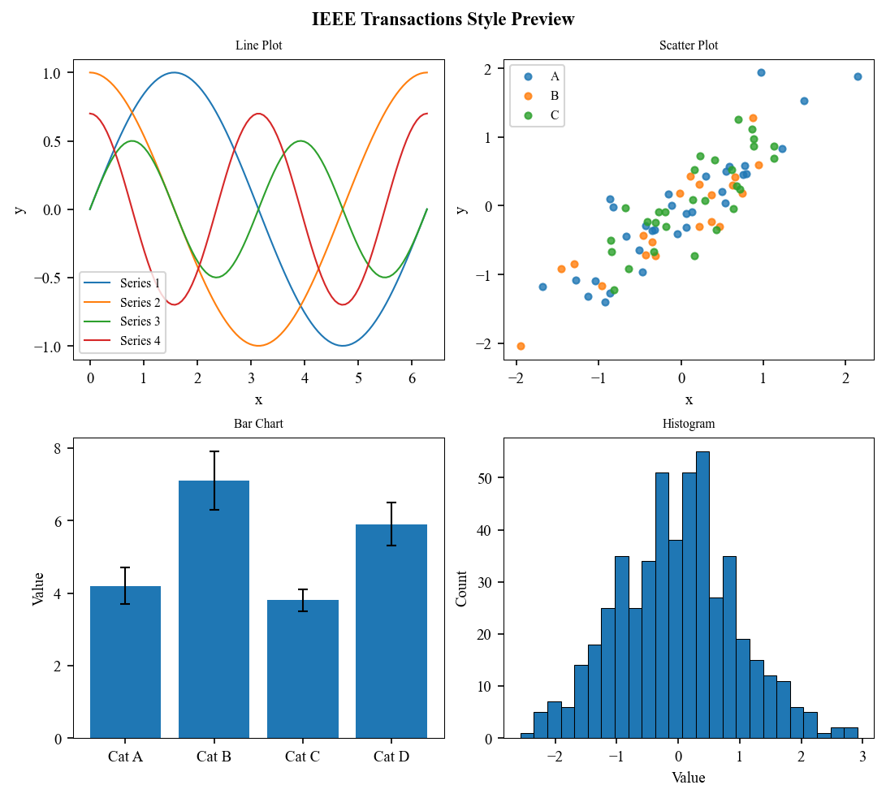

# Preview — `plotstyle.preview`

Gallery and print-size preview utilities.

## `gallery`

```{eval-rst}
.. autofunction:: plotstyle.preview.gallery.gallery
```

## `preview_print_size`

```{eval-rst}
.. autofunction:: plotstyle.preview.print_size.preview_print_size
```

## Usage

### Generate a gallery preview

`gallery()` creates a 2×2 grid of representative plots (line, scatter, bar,
histogram) styled to match a journal's settings:

```python
import plotstyle

fig = plotstyle.gallery("nature", columns=1)
fig.savefig("nature_gallery.png", dpi=150)
```

**Output (Nature):**



For a double-column gallery:

```python
fig = plotstyle.gallery("ieee", columns=2)
```

**Output (IEEE):**



### Preview at physical print size

`preview_print_size()` scales a figure's DPI so it appears at its actual
physical size on screen:

```python
import plotstyle

with plotstyle.use("nature") as style:
    fig, ax = style.figure()
    ax.plot([1, 2, 3])

    plotstyle.preview_print_size(fig, journal="nature", columns=1)
```

An annotation showing the target width in millimetres is added during the
preview window.

#### Monitor DPI

Accuracy depends on `monitor_dpi` matching your display:

| Display | Typical `monitor_dpi` |
|---------|----------------------|
| Windows / most Linux | `96` (default) |
| macOS 1× logical | `144` |
| macOS 2× Retina | `192` |

```python
plotstyle.preview_print_size(fig, journal="nature", monitor_dpi=144)
```

## Notes

- `gallery()` applies the journal style internally and restores rcParams when
  it returns. It never permanently alters global state.
- `preview_print_size()` restores the original DPI after `plt.show()` returns.
