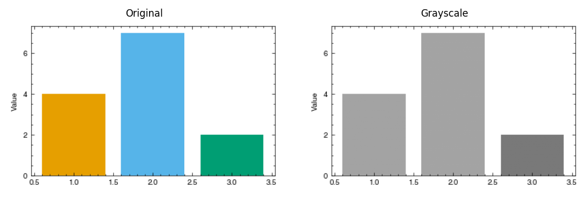

# Accessibility Checks

How to check that your figures are readable by people with colour vision
deficiencies and legible in grayscale print.

## Colorblind preview

`preview_colorblind()` generates a side-by-side view of your figure under
three types of colour vision deficiency:

```python
import matplotlib.pyplot as plt
import plotstyle
from plotstyle.color.accessibility import preview_colorblind

with plotstyle.use("nature") as style:
    fig, ax = style.figure()
    colors = style.palette(n=3)
    ax.bar([1, 2, 3], [4, 7, 2], color=colors)
    ax.set_ylabel("Value")

    comp = preview_colorblind(fig)
    comp.savefig("cvd_comparison.png", dpi=150)
```

This produces a four-panel figure:

```
[ Original | Deuteranopia | Protanopia | Tritanopia ]
```

If your colour-coded elements look the same in any panel, consider switching
to a different palette or adding markers, patterns, or direct labels.

**Output:**


### Preview specific deficiency types

```python
from plotstyle.color.accessibility import preview_colorblind, CVDType

comp = preview_colorblind(fig, cvd_types=[CVDType.DEUTERANOPIA, CVDType.PROTANOPIA])
```

## Grayscale preview

For journals like IEEE that require grayscale-safe figures:

```python
from plotstyle.color.grayscale import preview_grayscale

comp = preview_grayscale(fig)
comp.savefig("grayscale_comparison.png", dpi=150)
```

This produces a two-panel figure: `[Original | Grayscale]`.

**Output:**



## Programmatic grayscale check

Instead of visual inspection, check numerically:

```python
import plotstyle
from plotstyle.color.grayscale import is_grayscale_safe, luminance_delta

colors = plotstyle.palette("nature", n=4)

# Quick pass/fail
safe = is_grayscale_safe(colors, threshold=0.1)
print(f"Grayscale safe: {safe}")

# Pairwise detail
pairs = luminance_delta(colors)
for idx_a, idx_b, delta in pairs:
    status = "OK" if delta >= 0.1 else "FAIL"
    print(f"  {status} Colors {idx_a} vs {idx_b}: delta = {delta:.3f}")
```

Common threshold values:

| Threshold | When to use |
|-----------|-------------|
| `0.10` | Practical minimum for most print media |
| `0.15` | Recommended for high-quality print |
| `0.20` | Conservative; good for low-quality printers |

## Tips

1. Check your journal's spec to see if colorblind or grayscale safety is
   required (`spec.color.colorblind_required`, `spec.color.grayscale_required`).
2. Use `plotstyle.palette()` — the built-in palettes are already optimised for
   each journal's requirements.
3. Add redundant encoding (markers, linestyles, or direct labels) so that
   colour is not the only way to tell series apart.
4. Run `plotstyle.validate()` as a final check — it flags colour accessibility
   issues automatically.
