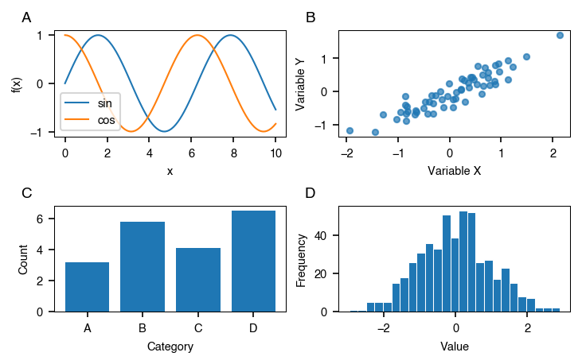

# Multi-Panel Figures

How to create multi-panel figures with automatic panel labels.

## Basic 2x2 grid

```python
import numpy as np
import plotstyle

with plotstyle.use("science") as style:
    fig, axes = style.subplots(nrows=2, ncols=2, columns=2)

    x = np.linspace(0, 2 * np.pi, 100)

    axes[0, 0].plot(x, np.sin(x))
    axes[0, 0].set_ylabel("sin(x)")

    axes[0, 1].plot(x, np.cos(x))
    axes[0, 1].set_ylabel("cos(x)")

    axes[1, 0].plot(x, np.sin(2 * x))
    axes[1, 0].set_ylabel("sin(2x)")

    axes[1, 1].plot(x, np.cos(2 * x))
    axes[1, 1].set_ylabel("cos(2x)")

    style.savefig(fig, "multi_panel.pdf")
```

Panel labels are added automatically in the journal's style — all current specs
use bold lowercase (**a**, **b**, **c**, **d**).

**Output:**



## Panel label styles

All built-in journal specs use **bold lowercase** panel labels (a, b, c, …).
The label format is controlled by the `panel_label_case` and
`panel_label_weight` fields in each journal spec, so future specs can use
different styles without code changes.

Supported label formats:

| `panel_label_case` | Example |
|-------------------|---------|
| `lower` | a, b, c |
| `upper` | A, B, C |
| `title` | A, B, C (alias for `upper`) |
| `parens_lower` | (a), (b), (c) |
| `parens_upper` | (A), (B), (C) |
| `sentence` | A, b, c (first panel capitalised only) |

PlotStyle picks the right style automatically from the journal spec.

## Turn off panel labels

If you want to manage labels yourself:

```python
fig, axes = style.subplots(nrows=1, ncols=3, panels=False)
```

## Single-column vs double-column

```python
# Single-column — fits within one text column
fig, axes = style.subplots(nrows=1, ncols=2, columns=1)

# Double-column — spans the full page width
fig, axes = style.subplots(nrows=1, ncols=2, columns=2)
```

## Custom aspect ratio

The default aspect ratio is the golden ratio (≈ 1.618). For square panels:

```python
fig, axes = style.subplots(nrows=2, ncols=2, aspect=1.0)
```

## Iterating over axes

`subplots()` always returns a 2-D ndarray, even for single-row layouts. This
lets you use `axes[i, j]` indexing and `axes.flat` iteration consistently:

```python
fig, axes = style.subplots(nrows=2, ncols=3)

# Flat iteration — works for any shape
for ax in axes.flat:
    ax.plot([1, 2, 3])

# Indexed access
axes[0, 0].set_title("Top-left")
axes[1, 2].set_title("Bottom-right")
```

### Matplotlib-compatible mode (`squeeze=True`)

Pass `squeeze=True` to drop size-1 dimensions, matching `plt.subplots()`:

```python
# nrows=1, ncols=3 → axes is a 1-D array of length 3
fig, axes = style.subplots(nrows=1, ncols=3, squeeze=True)
for ax in axes:
    ax.plot([1, 2, 3])

# nrows=1, ncols=1 → axes is a bare Axes object
fig, ax = style.subplots(nrows=1, ncols=1, squeeze=True)
ax.plot([1, 2, 3])
```
