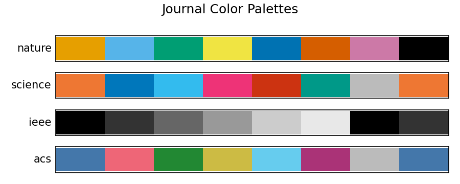

# Color Palettes

How to choose and use colorblind-safe palettes for your journal figures.

## Get colours for a journal

```python
import plotstyle

colors = plotstyle.palette("nature", n=4)
# ['#E69F00', '#56B4E9', '#009E73', '#F0E442']
```

Use them directly in your plots:

```python
import numpy as np

with plotstyle.use("nature") as style:
    fig, ax = style.figure()
    x = np.linspace(0, 10, 100)
    colors = style.palette(n=3)

    ax.plot(x, np.sin(x), color=colors[0], label="sin(x)")
    ax.plot(x, np.cos(x), color=colors[1], label="cos(x)")
    ax.plot(x, np.sin(x + 1), color=colors[2], label="sin(x+1)")
    ax.legend()
```

**Output:**



## Add markers and linestyles

For journals that require grayscale-safe figures, use `with_markers=True`.
This returns `(color, linestyle, marker)` tuples so series remain
distinguishable in black-and-white print:

```python
styled = style.palette(n=4, with_markers=True)

for i, (color, ls, marker) in enumerate(styled):
    ax.plot(x, np.sin(x + i), color=color, linestyle=ls,
            marker=marker, markevery=10, label=f"Series {i+1}")
```

## Which palette does each journal get?

| Journal | Palette | Why |
|---------|---------|-----|
| Nature, PLOS, Cell | Okabe–Ito | Most widely used colorblind-safe palette |
| ACS, Elsevier, Springer | Tol Bright | High contrast on white backgrounds |
| PRL, Wiley | Tol Muted | Softer tones for dense plots |
| Science | Tol Vibrant | High contrast for small figures |
| IEEE | Safe Grayscale | Distinguishable in black-and-white print |

## Apply a palette to the colour cycle

`apply_palette()` sets the default colour cycle so every new plot on those
axes uses the palette automatically — no need to pass `color=` manually:

```python
import plotstyle
import matplotlib.pyplot as plt

# Global: all axes created after this call use tol-bright
plotstyle.apply_palette("tol-bright")

fig, ax = plt.subplots()
ax.plot([1, 2, 3])   # first tol-bright colour
ax.plot([3, 2, 1])   # second tol-bright colour
```

To restrict the change to a single axes:

```python
fig, (ax1, ax2) = plt.subplots(1, 2)
plotstyle.apply_palette("okabe-ito", ax=ax1)  # only ax1 uses Okabe-Ito
```

> **Note:** `apply_palette()` does not retroactively recolour artists that are
> already drawn. Call it before plotting to ensure the new cycle is used from
> the first line.

## Check if colours are grayscale-safe

```python
from plotstyle.color.grayscale import is_grayscale_safe

colors = plotstyle.palette("nature", n=4)
print(is_grayscale_safe(colors))  # True or False
```

See the [Accessibility guide](accessibility.md) for more.

## Load a palette by name

If you want a specific palette regardless of journal:

```python
from plotstyle.color.palettes import load_palette

colors = load_palette("tol-vibrant")   # ['#EE7733', '#0077BB', ...]
```

Names accept either hyphens (`tol-bright`) or underscores (`tol_bright`).

All available palettes:

| Name | Colours |
|------|---------|
| `okabe-ito` | 8 |
| `tol-bright` | 7 |
| `tol-muted` | 10 |
| `tol-vibrant` | 7 |
| `tol-light` | 9 |
| `tol-high-contrast` | 3 |
| `tol-rainbow-4` | 4 |
| `tol-rainbow-6` | 6 |
| `tol-rainbow-8` | 8 |
| `tol-rainbow-10` | 10 |
| `tol-rainbow-12` | 12 |
| `safe-grayscale` | 6 |

To list all palettes programmatically:

```python
import plotstyle
print(plotstyle.list_palettes())
```
