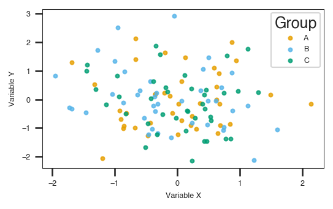

# Seaborn Integration

How to use PlotStyle with Seaborn without one overriding the other.

See the working example: [`examples/11_seaborn_integration.py`](../../examples/11_seaborn_integration.py)

## The problem

Both PlotStyle and Seaborn write to `matplotlib.rcParams`. When you call
`sns.set_theme()`, Seaborn resets fonts, sizes, and line widths — undoing
everything PlotStyle set.

## Solution 1: Automatic patch (recommended)

Pass `seaborn_compatible=True` to `plotstyle.use()`. PlotStyle's settings
survive any `sns.set_theme()` calls made inside the `with` block:

```python
import plotstyle
import seaborn as sns
import pandas as pd

df = pd.DataFrame({
    "x": [1, 2, 3, 4],
    "y": [2, 4, 3, 5],
    "group": ["A", "A", "B", "B"],
})

with plotstyle.use("nature", seaborn_compatible=True) as style:
    sns.set_theme(style="ticks")   # PlotStyle settings are preserved

    fig, ax = style.figure()
    sns.scatterplot(data=df, x="x", y="y", hue="group", ax=ax)
    style.savefig(fig, "seaborn_figure.pdf")
```

The patch is removed automatically when the `with` block ends.

**Output:**



## Solution 2: One-shot helper

If you only need to call `sns.set_theme()` once at the start of a script:

```python
from plotstyle.integrations.seaborn import plotstyle_theme

# Applies the seaborn theme first, then overlays PlotStyle settings on top.
plotstyle_theme("nature", seaborn_style="ticks", seaborn_context="paper")
```

After this call, Matplotlib's rcParams reflect both the seaborn theme and the
journal's PlotStyle settings. Create figures directly with `plt.subplots()` or
use a separate `plotstyle.use()` call to get a handle for `style.figure()`,
`style.validate()`, and `style.savefig()`. Note that `plotstyle_theme()` does
not return a handle and does not restore rcParams on exit — it is a global,
persistent configuration call.

## Tips

- Apply `plotstyle.use()` **before** `sns.set_theme()` when using the patch.
- Calling `patch_seaborn()` more than once is safe — it won't double-wrap.
- The patch is **not thread-safe**. Avoid concurrent use from multiple threads.
- Seaborn is an optional dependency. Install it with `pip install "plotstyle[seaborn]"`.
