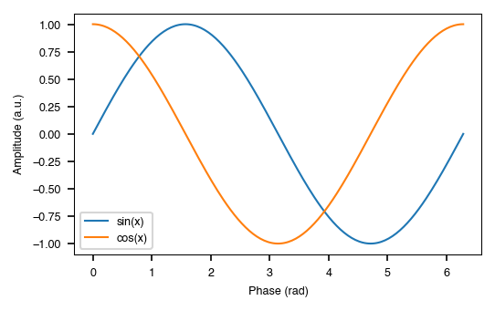

# Quick Start

Five minutes to your first publication-ready figure.

## 1. Apply a journal style

Call `plotstyle.use()` with a journal name. This sets the right fonts, sizes,
and line widths for that journal. Use it as a context manager — the original
Matplotlib settings are restored automatically when the block ends.

```python
import plotstyle

with plotstyle.use("nature") as style:
    # Matplotlib is now configured for Nature
    ...
# Matplotlib is back to normal here
```

You can also restore manually if a context manager doesn't fit your workflow:

```python
style = plotstyle.use("nature")
# ... do work ...
style.restore()
```

## 2. Create a correctly-sized figure

`style.figure()` creates a single-axis figure at the journal's exact column
width. No need to look up the measurements yourself.

```python
import numpy as np
import plotstyle

with plotstyle.use("nature") as style:
    fig, ax = style.figure(columns=1)   # single-column width (89 mm)

    x = np.linspace(0, 2 * np.pi, 200)
    ax.plot(x, np.sin(x), label="sin(x)")
    ax.plot(x, np.cos(x), label="cos(x)")
    ax.set_xlabel("Phase (rad)")
    ax.set_ylabel("Amplitude (a.u.)")
    ax.legend()
```

For multi-panel layouts, use `style.subplots()`. Panel labels like **(a)**,
**(b)** are added automatically in the journal's style:

```python
with plotstyle.use("science") as style:
    fig, axes = style.subplots(nrows=2, ncols=2, columns=2)
    for ax in axes.flat:
        ax.plot([1, 2, 3])
```

## 3. Use colorblind-safe colours

`style.palette()` returns colours from the journal's recommended palette:

```python
colors = style.palette(n=4)
# e.g. ['#E69F00', '#56B4E9', '#009E73', '#F0E442']
```

For journals that require grayscale-safe figures (like IEEE), add markers and
linestyles to tell series apart even in black-and-white print:

```python
styled = style.palette(n=3, with_markers=True)
for color, linestyle, marker in styled:
    ax.plot(x, y, color=color, linestyle=linestyle, marker=marker)
```

## 4. Validate before submitting

`style.validate()` checks your figure against the journal's requirements —
dimensions, font sizes, line weights, and colour rules:

```python
report = style.validate(fig)
print(report.passed)    # True / False
print(report.failures)  # list of issues with fix suggestions
print(report)           # formatted table
```

## 5. Save for submission

`style.savefig()` saves with TrueType font embedding and the journal's
required DPI — two things that journal submission portals often check:

```python
style.savefig(fig, "figure1.pdf")
```

To export in every format the journal accepts (PDF, TIFF, EPS, etc.):

```python
style.export_submission(fig, "figure1", output_dir="submission/")
```

## Complete example

```python
import numpy as np
import plotstyle

with plotstyle.use("nature") as style:
    fig, ax = style.figure(columns=1)

    x = np.linspace(0, 2 * np.pi, 200)
    colors = style.palette(n=2)
    ax.plot(x, np.sin(x), color=colors[0], label="sin(x)")
    ax.plot(x, np.cos(x), color=colors[1], label="cos(x)")
    ax.set_xlabel("Phase (rad)")
    ax.set_ylabel("Amplitude (a.u.)")
    ax.legend()

    report = style.validate(fig)
    assert report.passed, report.failures

    style.savefig(fig, "quickstart_nature.pdf")
```

**Output:**


